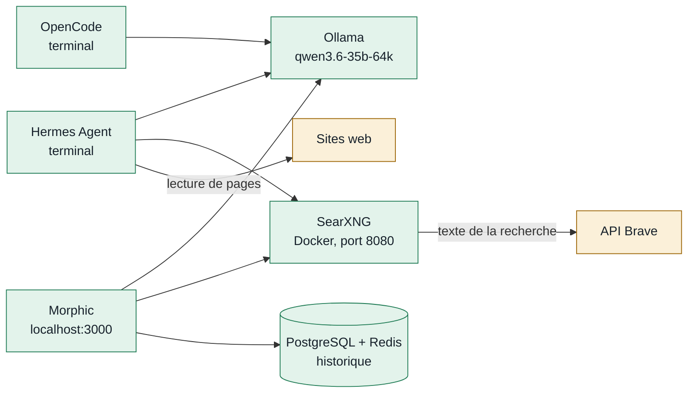

# Votre IA locale, mode d'emploi

> **Guide complet · version du 7 octobre 2026**
>
> Trois agents d'intelligence artificielle tournent sur votre PC :
> - **Hermes** pour réfléchir et apprendre ;
> - **Morphic** pour chercher sur le web ;
> - **OpenCode** pour coder.
>
> Ils partagent un seul cerveau, le modèle **Qwen 3.6**, qui ne quitte jamais votre machine. Ce guide explique tout : démarrer, bien s'en servir, protéger vos données, entretenir, réparer.

| Coût | Modèle | Ollama | Hermes | OpenCode | Recherche | Fuite vers une IA en ligne |
|---|---|---|---|---|---|---|
| **0 €** | `qwen3.6-35b-64k` | 0.40.0 | 0.21.5 | 1.18 | API Brave | **aucune** |

Une version mise en page de ce guide existe aussi : [`docs/guide-complet.html`](docs/guide-complet.html). Téléchargez-la, puis ouvrez-la d'un double-clic dans votre navigateur.

## Sommaire

1. [Démarrage rapide](#demarrage-rapide)
2. [Comprendre en 10 notions](#comprendre)
3. [Comment tout s'assemble](#architecture)
4. [Allumer et éteindre](#allumer)
5. [Hermes Agent : l'agent qui apprend](#hermes)
6. [Morphic : le moteur de réponses](#morphic)
7. [OpenCode : l'agent de code](#opencode)
8. [Ollama et les modèles](#ollama)
9. [Bien parler à une IA locale](#prompts)
10. [Performances et santé du matériel](#materiel)
11. [Confidentialité et sécurité](#confidentialite)
12. [Coûts](#couts)
13. [Mises à jour](#mises-a-jour)
14. [Données et sauvegardes](#sauvegardes)
15. [Dépannage](#depannage)
16. [Limites et bon usage](#limites)
17. [Aide-mémoire](#aide-memoire)
18. [Glossaire](#glossaire)

---

<a name="demarrage-rapide"></a>
## 1. Démarrage rapide

Si vous ne lisez qu'un chapitre, lisez celui-ci. Toutes les commandes se tapent dans **PowerShell** : touche Windows, tapez « PowerShell », Entrée.

**Étape 1 : tout allumer.** Le script démarre Ollama, Docker, Morphic et le moteur de recherche. Comptez 1 à 3 minutes.

```powershell
& "C:\Users\ateat\source\repos\ia-locale\scripts\demarrer-ia-locale.ps1"
```

Résultat attendu : quatre lignes **OK**, puis « Prêt ».

**Étape 2 : choisir l'outil selon le besoin.**

| Besoin | Outil | Comment l'ouvrir |
|---|---|---|
| Réfléchir, organiser, apprendre | **Hermes Agent** | Tapez `hermes`. Il se souvient de vous, cherche sur le web, lit des pages, délègue à des sous-agents. |
| Chercher une réponse avec ses sources | **Morphic** | Ouvrez http://localhost:3000. Comme Perplexity : question, recherche Brave, réponse sourcée. |
| Écrire et comprendre du code | **OpenCode** | Ouvrez PowerShell dans un dossier de code, tapez `opencode`. Il lit, explique et modifie vos fichiers avec votre accord. |

**Étape 3 : tout éteindre** quand vous avez fini, pour rendre la mémoire au PC. Vos données sont conservées.

```powershell
& "C:\Users\ateat\source\repos\ia-locale\scripts\arreter-ia-locale.ps1"
```

> [!NOTE]
> Une IA locale est plus lente qu'une IA en ligne : comptez 20 secondes à 3 minutes par réponse, selon l'outil. C'est le prix de la confidentialité et de la gratuité. Laissez-la travailler.

---

<a name="comprendre"></a>
## 2. Comprendre en 10 notions

Pas besoin d'être informaticien. Ces dix idées expliquent presque tout ce que vous verrez à l'écran.

| Notion | Ce que c'est | Chez vous |
|---|---|---|
| **Modèle de langage** | Un très gros fichier de nombres qui a appris à prédire la suite d'un texte. C'est le « cerveau » des trois outils. | Qwen 3.6 35B, 21 Go sur le disque |
| **Paramètres** | Les nombres du modèle. Plus il y en a, plus le modèle est capable, et plus il est lourd. | 35,5 milliards |
| **MoE (mélange d'experts)** | Le modèle est découpé en « experts » ; à chaque mot, seuls quelques-uns travaillent. Résultat : la qualité d'un gros modèle à la vitesse d'un petit. | 3 milliards actifs par mot, sur 35 |
| **Jeton (token)** | L'unité de texte du modèle : un morceau de mot. En français, 100 jetons font environ 70 mots. | 12 à 20 jetons écrits par seconde |
| **Contexte** | La mémoire de travail d'une conversation : tout ce que le modèle « voit » à un instant. Au-delà, il oublie le début. | 64 000 jetons, soit environ 45 000 mots ou 90 pages |
| **Quantification** | Compression du modèle (nombres moins précis) pour qu'il tienne en mémoire, avec une perte de qualité minime. | Q4_K_M (environ 4,5 bits par nombre) |
| **Mémoire graphique et mémoire vive** | La carte graphique calcule très vite mais a peu de mémoire. Le reste du modèle va en mémoire vive, où le processeur le traite. | 17 % sur la carte graphique (8 Go), 83 % sur le processeur (32 Go) |
| **Agent** | Une IA qui ne fait pas que répondre : elle utilise des **outils** (chercher, lire un fichier, ouvrir une page) en plusieurs étapes, jusqu'à finir la tâche. | Hermes et OpenCode sont des agents |
| **Sous-agent** | Un agent lancé par un autre agent pour une sous-tâche. Il a son propre contexte, puis il rend un résumé. | Hermes : au plus 2 en même temps |
| **Réflexion (thinking)** | Le modèle écrit d'abord un raisonnement interne avant de répondre. C'est plus lent, mais plus juste. | Visible dans Morphic (« Thoughts ») |

---

<a name="architecture"></a>
## 3. Comment tout s'assemble

Les trois outils parlent au même serveur **Ollama**, qui fait tourner le modèle. Pour le web, ils passent par **SearXNG**, un petit moteur de recherche installé dans Docker, qui interroge l'**API officielle de Brave**. Tout communique par l'adresse `127.0.0.1`, qui veut dire « ce PC-ci » : rien n'est ouvert sur votre Wi-Fi.



En vert, ce qui reste sur le PC ; en jaune, ce qui sort du PC.

### Les ports utilisés

| Port | Service | Accessible depuis |
|---|---|---|
| 11434 | Ollama (le modèle) | ce PC seulement |
| 3000 | Morphic (interface web) | ce PC seulement |
| 8080 | SearXNG (recherche) | ce PC seulement |
| 5433 | PostgreSQL de Morphic | ce PC seulement |
| 6379 | Redis de Morphic (cache) | ce PC seulement |

---

<a name="allumer"></a>
## 4. Allumer et éteindre

### Ce qui démarre tout seul avec Windows

Seul **Ollama** se lance au démarrage de Windows, comme avant ce projet. Au repos, sans question en cours, il consomme très peu. Docker, Morphic, Hermes et OpenCode ne démarrent **jamais** seuls.

Pour empêcher aussi Ollama de démarrer :
1. Ouvrez le Gestionnaire des tâches (<kbd>Ctrl</kbd>+<kbd>Maj</kbd>+<kbd>Échap</kbd>).
2. Allez dans **Applications de démarrage**.
3. Sélectionnez Ollama, puis cliquez sur **Désactiver**.

Le script de démarrage le relancera quand il le faut.

### Le script de démarrage, étape par étape

1. Il lance Ollama **par l'Explorateur Windows**, comme un clic dans le menu Démarrer. C'est important : voir l'erreur 448 au chapitre [Dépannage](#depannage).
2. Il ouvre Docker Desktop et attend qu'il réponde (jusqu'à 4 minutes au premier lancement).
3. Il démarre les quatre conteneurs de Morphic : application, PostgreSQL, Redis et SearXNG.
4. Il vérifie que SearXNG et Morphic répondent, puis affiche « Prêt ».

### Vérifier ce qui tourne

```powershell
ollama ps
docker ps --format "{{.Names}} : {{.Status}}"
hermes status
```

- `ollama ps` liste le modèle chargé ; la liste est vide s'il dort.
- `docker ps` doit montrer **4 conteneurs « Up »** quand Morphic est allumé.

### Faut-il tout allumer à chaque fois ?

| Vous voulez utiliser | Il faut |
|---|---|
| OpenCode | Ollama seulement (déjà lancé au démarrage de Windows) |
| Hermes sans recherche web | Ollama seulement |
| Hermes avec recherche web | Ollama + Docker (pour SearXNG) : le script de démarrage |
| Morphic | Ollama + Docker : le script de démarrage |

---

<a name="hermes"></a>
## 5. Hermes Agent : l'agent qui apprend

Hermes est un agent généraliste. Il peut :
- discuter et chercher sur le web ;
- lire des pages avec son propre navigateur ;
- lire et écrire des fichiers ;
- garder une mémoire de vous ;
- créer ses propres « compétences » avec l'expérience ;
- confier des sous-tâches à des sous-agents.

### Lancer et quitter

```powershell
hermes
```

- Tapez votre message, puis <kbd>Entrée</kbd>. La première réponse prend souvent **1 à 3 minutes**, car Hermes envoie de longues consignes au modèle.
- Pour interrompre une réponse trop longue : <kbd>Ctrl</kbd>+<kbd>C</kbd>.
- Pour quitter : `/quit` (ou `/exit`).
- Pour voir toutes les commandes : <kbd>Ctrl</kbd>+<kbd>P</kbd>, ou `/help`.

Pour poser une seule question sans ouvrir de conversation :

```powershell
hermes chat -q "Résume en 5 points les causes d'une entorse de cheville"
```

### Les commandes « / » les plus utiles

Elles se tapent **dans la conversation d'Hermes**, pas dans PowerShell.

| Commande | Effet |
|---|---|
| `/new` | Nouvelle conversation. À faire à chaque changement de sujet : le modèle reste plus précis. |
| `/sessions` · `/resume` | Parcourir et reprendre une ancienne conversation |
| `/title Mon sujet` | Donner un nom à la conversation |
| `/retry` · `/undo` | Refaire la dernière réponse · revenir un message en arrière |
| `/status` · `/context` | Modèle, jetons utilisés, remplissage du contexte (jauge) |
| `/compress` | Résumer la conversation pour libérer du contexte |
| `/plan` | Écrire un plan d'action sans rien exécuter |
| `/goal` | Fixer un objectif sur lequel Hermes travaille jusqu'à ce qu'il soit atteint |
| `/bg` | Lancer une demande en arrière-plan, dans une session séparée |
| `/btw` | Poser une question annexe sans interrompre le travail en cours |
| `/queue` · `/steer` | Préparer le message suivant · glisser une consigne pendant qu'il travaille |
| `/agents` | Voir les agents et sous-agents en cours |
| `/memory` | Revoir ce qu'il veut mémoriser, ou exiger votre accord avant chaque ajout |
| `/skills` · `/learn` | Gérer les compétences · lui en faire apprendre une à partir d'une description, d'un dossier ou de la conversation |
| `/refine` | Lui faire tirer les leçons de la conversation (mémoire et compétences) |
| `/tools list` · `/toolsets` | Voir les outils actifs |
| `/image` · `/paste` | Joindre une image (fichier ou presse-papiers) : le modèle sait lire les images |
| `/copy` · `/save` | Copier la dernière réponse · exporter la conversation |
| `/cron` | Gérer les tâches planifiées |
| `/usage` · `/insights` | Statistiques d'utilisation |
| `/version` · `/update` | Voir la version · mettre à jour |

### La mémoire : comment Hermes se souvient de vous

Toutes ses mémoires sont stockées sur votre PC, dans `%LOCALAPPDATA%\hermes`.

| Mémoire | Contenu | Fichier |
|---|---|---|
| Profil | Qui vous êtes, vos préférences. Déjà rempli : « étudiant ingénieur francophone, biomécanique, chef de projet ». | `memories\USER.md` |
| Notes de l'agent | Ce qu'il a appris en travaillant : faits, astuces, conventions | `memories\MEMORY.md` |
| Conversations | Tout l'historique, qu'il peut rechercher et résumer (« Session Search ») | `sessions\` |
| Compétences | Méthodes réutilisables qu'il écrit lui-même après une tâche réussie | `skills\` |

- **Lui apprendre quelque chose :** « Retiens que je rends mes rapports en LaTeX. »
- **Lui faire oublier :** « Oublie ce que tu sais sur mon stage. » Vous pouvez aussi ouvrir `USER.md` ou `MEMORY.md` dans le Bloc-notes et effacer la ligne vous-même.
- **Contrôler ce qu'il retient :** avec `/memory`, vous pouvez exiger votre accord avant chaque ajout.
- **Taille limitée :** la mémoire est volontairement limitée. Quand elle est pleine, Hermes résume et remplace les vieilles notes.
- **Rangement automatique :** un « conservateur » range les compétences en arrière-plan, pour la première fois environ 7 jours après l'installation. Il archive, mais ne supprime jamais rien. Pour voir ce qu'il ferait : `hermes curator run --dry-run`.

### Les sous-agents

Demandez-le en clair, par exemple : « Utilise deux sous-agents : l'un compare les orthèses de genou A et B, l'autre cherche les études récentes, puis fais une synthèse. » Chaque sous-agent a son propre contexte et rend un résumé.

> [!WARNING]
> Les sous-agents partagent le même modèle local : ils avancent surtout **les uns après les autres**, pas vraiment en parallèle. Le réglage limite à 2 sous-agents simultanés pour ne pas saturer la mémoire. Une tâche avec sous-agents prend facilement 2 à 10 minutes.

### La recherche web et le navigateur

- **Recherche** (`web_search`) : elle passe par SearXNG, puis par l'API Brave. **Morphic doit être allumé** (script de démarrage), sinon la recherche échoue.
- **Lecture de pages** : Hermes ouvre la page dans **son propre Chromium**, sur votre PC, sans vos comptes ni vos mots de passe. Les services en ligne de lecture de pages sont volontairement coupés.
- **Crédit Brave** : chaque recherche consomme une requête de votre crédit gratuit (voir [Coûts](#couts)).

### Les tâches planifiées

Hermes peut exécuter une tâche à heure fixe, par exemple : « chaque lundi à 8 h, fais-moi la liste des articles sur l'exosquelette ». Ces tâches ne tournent **que si la passerelle d'Hermes est allumée**, et elle ne démarre jamais seule.

```powershell
hermes cron list
hermes gateway run
```

- `hermes gateway run` occupe la fenêtre PowerShell : fermez-la pour arrêter les tâches.
- `hermes cron status` indique si le planificateur tourne.
- `hermes pause` est l'arrêt d'urgence.

### Les outils autorisés (liste blanche)

Hermes a 91 outils dans son code. **32 sont autorisés**, en 10 groupes ; tout le reste est coupé.

| Groupe | Permet | État |
|---|---|---|
| `search` | Recherche web (Brave) | ✅ actif |
| `browser` | Navigateur local : ouvrir, lire, cliquer, remplir | ✅ actif |
| `file` | Lire, écrire, modifier, chercher des fichiers | ✅ actif |
| `memory` · `session_search` | Mémoire durable · recherche dans les anciennes conversations | ✅ actif |
| `skills` | Créer et utiliser des compétences | ✅ actif |
| `delegation` | Sous-agents | ✅ actif |
| `cronjob` | Tâches planifiées | ✅ actif |
| `todo` · `clarify` | Liste d'étapes · vous poser une question | ✅ actif |
| `terminal` · `code_execution` | Lancer n'importe quelle commande ou programme sur le PC | ⛔ coupé |
| `computer_use` | Piloter la souris et le clavier | ⛔ coupé (non installé) |
| `image_gen` · `tts` · `vision` | Images et voix (services en ligne) · analyse d'image dédiée | ⛔ coupé |
| `connections` · messageries | Comptes en ligne, Telegram, Discord, WhatsApp… | ⛔ coupé |

```powershell
hermes tools --summary
hermes tools enable vision
hermes tools disable vision
```

Pour revenir exactement aux réglages de ce guide :

```powershell
& "C:\Users\ateat\source\repos\ia-locale\config\hermes\appliquer-reglages-hermes.ps1"
```

> [!CAUTION]
> **À ne pas faire**
> - `/yolo` : supprime toutes les demandes d'autorisation.
> - Activer `terminal` ou `code_execution` sans bien comprendre : l'agent pourrait exécuter n'importe quelle commande.
> - `/browser`, qui le brancherait sur **votre** navigateur : il aurait alors accès à vos sessions ouvertes.
> - `/login`, `hermes portal`, `hermes model` vers un fournisseur en ligne, ou `/moa` : vos messages partiraient chez un tiers.

### Entretien d'Hermes

| Commande | Rôle |
|---|---|
| `hermes doctor` | Diagnostic complet. L'avertissement « web extract : no provider » est normal et voulu. |
| `hermes update` | Mise à jour ; vos réglages sont conservés |
| `hermes backup -o C:\Users\ateat\source\sauvegardes\hermes.zip` | Sauvegarde de la mémoire, des compétences et des conversations |
| `hermes security` | Audit des dépendances (failles connues) |
| `hermes config get model.default` | Lire un réglage |

---

<a name="morphic"></a>
## 6. Morphic : le moteur de réponses

Morphic remplace Perplexity. Vous posez une question ; il cherche sur le web avec Brave, lit les résultats et rédige une réponse en citant ses sources. Il ne fonctionne que si le script de démarrage a été lancé.

1. Ouvrez http://localhost:3000 dans votre navigateur.
2. En bas à droite de la zone de saisie, cliquez sur le nom du modèle et choisissez **qwen3.6-35b-64k:latest**. Le choix est mémorisé.
3. Tapez votre question et appuyez sur <kbd>Entrée</kbd>. Vous verrez d'abord la réflexion du modèle (« Thoughts »), puis la recherche (« ✓ 10 results »), puis la réponse avec ses sources.

| Élément | Usage |
|---|---|
| Modes Quick / Adaptive | Quick : rapide, une ou deux recherches. Adaptive : enquête plus poussée, avec plus de recherches (plus long et plus de crédit Brave). |
| Boutons Decide, Troubleshoot, How-to… | Modèles de question : décider, dépanner, apprendre à faire, comprendre, créer |
| Barre latérale (icône en haut à gauche) | Historique de vos recherches, enregistré dans la base PostgreSQL locale |
| Autres modèles | `qwen3.5:9b` : 3 à 4 fois plus rapide, moins précis ; pratique pour les questions simples |

> [!NOTE]
> **Ce qui a été réglé pour vous**
> - Moteur de recherche : **API Brave uniquement**, jamais Google.
> - Icônes des sites désactivées : elles passaient par un service de Google.
> - Le service Tavily est rendu injoignable. Sans ce blocage, Morphic lui enverrait l'adresse des PDF lus, même sans clé.
> - Aucun compte : vous êtes le seul utilisateur, et l'application n'est visible que depuis ce PC.
> - Aucun redémarrage automatique des conteneurs.

Commandes utiles, à lancer dans le dossier de Morphic :

```powershell
Set-Location C:\Users\ateat\source\outils\morphic
docker compose ps
docker compose logs --tail 50 morphic
docker compose restart searxng
docker compose stop
```

---

<a name="opencode"></a>
## 7. OpenCode : l'agent de code

OpenCode travaille dans un dossier de projet. Il lit votre code, l'explique, propose et applique des modifications, et lance des commandes (tests, scripts). Il le fait toujours avec votre accord.

### Lancer

```powershell
Set-Location C:\Users\ateat\source\repos\ia-locale\essai-opencode
opencode
```

L'interface s'ouvre dans le terminal, avec le modèle **ollama/qwen3.6-35b-64k** déjà choisi.

### Les deux modes (touche <kbd>Tab</kbd> pour changer)

| Mode | Ce qu'il fait |
|---|---|
| **Build** | Peut modifier les fichiers et lancer des commandes. Il **vous demande l'autorisation** avant chaque modification et chaque commande (réglage ajouté pour vous). |
| **Plan** | Lit, explique et propose un plan, sans rien modifier. Idéal pour découvrir un projet ou préparer une modification. |

### Raccourcis et commandes

| Saisie | Effet |
|---|---|
| <kbd>Tab</kbd> | Passer de Build à Plan, et inversement |
| `@nom-de-fichier` | Joindre un fichier à la demande (recherche approximative du nom) |
| `!commande` | Lancer une commande vous-même, par exemple `!python angles.py` |
| `/init` | Créer un fichier `AGENTS.md` qui décrit le projet à l'agent (une fois par projet) |
| `/undo` · `/redo` | Annuler le dernier message **et ses modifications de fichiers** · rétablir |
| `/new` · `/sessions` | Nouvelle session · reprendre une session |
| `/models` | Changer de modèle |
| `/compact` | Résumer la session pour libérer du contexte |
| `/thinking` · `/details` | Afficher la réflexion · le détail des outils |
| `/export` | Enregistrer la conversation en Markdown |
| <kbd>Ctrl</kbd>+<kbd>P</kbd> · <kbd>Ctrl</kbd>+<kbd>X</kbd> puis <kbd>Q</kbd> | Palette de commandes · quitter |

### Le coût de la session

Il s'affiche dans l'interface et reste à **0,00 $**, puisque tout est calculé sur votre PC. Pour voir le total de toutes vos sessions :

```powershell
opencode stats
```

Pour faire une seule demande sans ouvrir l'interface :

```powershell
opencode run "Lis README.md et angles.py puis explique la fonction flexion_genou"
```

> [!WARNING]
> **Trois règles pour coder sereinement**
> 1. Travaillez **dans un dépôt Git** et faites un commit avant de laisser l'agent modifier quoi que ce soit : vous pourrez toujours revenir en arrière.
> 2. **Nommez les fichiers** à lire, ou utilisez `@` : ce modèle local se perd s'il doit tout chercher seul.
> 3. Lisez chaque demande d'autorisation avant d'accepter, surtout pour les commandes.

Les réglages sont dans `C:\Users\ateat\.config\opencode\opencode.json` (copie dans [`config/opencode`](config/opencode/opencode.json)). Seul le fournisseur Ollama est autorisé, et le partage de sessions est désactivé.

---

<a name="ollama"></a>
## 8. Ollama et les modèles

Ollama est le moteur qui fait tourner les modèles. Les trois outils lui envoient leurs demandes.

### Vos modèles

| Nom | Taille | Usage |
|---|---|---|
| `qwen3.6-35b-64k` | 22 Go | **Le modèle principal** des trois outils. C'est qwen3.6:35b avec 64K de contexte et une lecture directe depuis le disque (mmap). Il n'occupe aucun espace disque en plus. |
| `qwen3.6:35b` | 22 Go | Le modèle d'origine, avec un contexte réduit par défaut. Ne le supprimez pas : le précédent en dépend. |
| `qwen3.5:9b` | 6,6 Go | Plus petit et plus rapide, moins capable |
| `qwen3.5:4b` | 3,4 Go | Très rapide, pour des tâches simples |

### Commandes

| Commande | Effet |
|---|---|
| `ollama list` | Modèles installés |
| `ollama ps` | Modèle chargé, répartition processeur/carte graphique, contexte |
| `ollama stop qwen3.6-35b-64k` | Décharger le modèle de la mémoire (il se décharge seul après 5 minutes d'inactivité) |
| `ollama show qwen3.6-35b-64k --parameters` | Vérifier les réglages : `num_ctx 65536` et `use_mmap true` |
| `ollama run qwen3.5:9b` | Discuter directement avec un modèle (`/bye` pour quitter) |
| `ollama rm nom` | Supprimer un modèle **définitivement** : réfléchissez avant |

### Ajouter un modèle malgré un Wi-Fi qui coupe

`ollama pull` recommence de zéro à chaque coupure. Le script du dépôt, lui, reprend à l'octet près et vérifie chaque fichier :

```powershell
& "C:\Users\ateat\source\repos\ia-locale\scripts\telecharger-modele-ollama.ps1" -Modeles "gemma4:26b"
```

À la fin, il affiche **« PRÊT (… Go, SHA-256 vérifié) »**. Fermez puis relancez Ollama pour qu'il voie le nouveau modèle.

### Donner 64K de contexte à un nouveau modèle

Hermes refuse les modèles qui ont moins de 64 000 jetons de contexte. Pour en préparer un :
1. Copiez le fichier [`config/ollama/qwen3.6-35b-64k.Modelfile`](config/ollama/qwen3.6-35b-64k.Modelfile).
2. Remplacez la ligne `FROM` par le nom du nouveau modèle.
3. Lancez :

```powershell
ollama create mon-modele-64k -f C:\chemin\vers\mon-modele-64k.Modelfile
```

### Changer de modèle dans chaque outil

| Outil | Comment |
|---|---|
| Hermes | Pour une session : `/model nom`. Pour toujours : `hermes config set model.default nom` |
| OpenCode | `/models`. Un nouveau modèle doit d'abord être ajouté dans `opencode.json`, section `models`. |
| Morphic | Le sélecteur sous la zone de saisie : tous les modèles d'Ollama y apparaissent d'eux-mêmes |

---

<a name="prompts"></a>
## 9. Bien parler à une IA locale

Un modèle local est moins « devin » qu'un grand modèle en ligne. Ces habitudes changent tout.

| Habitude | Plutôt que… | Écrivez… |
|---|---|---|
| Une tâche à la fois | « Fais-moi un rapport complet sur la marche » | « Liste les 5 phases du cycle de marche avec leur durée en % » |
| Préciser le format | « Parle-moi du LCA » | « Explique le rôle du LCA en 3 phrases, en français, pour un étudiant ingénieur » |
| Nommer les fichiers | « Regarde mon projet » | « Lis README.md et angles.py, puis… » |
| Demander des sources | « C'est vrai que… ? » | « Cherche sur le web et cite 2 sources avec leur adresse » |
| Découper | Un long sujet dans une seule conversation | `/new` à chaque nouveau sujet ; `/compress` si la conversation s'allonge |
| Faire vérifier | Accepter la première réponse | « Relis ta réponse et corrige les erreurs de calcul » |

> [!WARNING]
> Le modèle peut inventer (« halluciner ») des chiffres, des références ou des noms de fonctions, et il fait des coquilles. Pour tout ce qui compte (cours, rapport, sujet médical, calcul de structure), vérifiez la source citée.

---

<a name="materiel"></a>
## 10. Performances et santé du matériel

### Vitesses mesurées sur votre PC

| Opération | Durée |
|---|---|
| Chargement du modèle | 16 à 21 s |
| Hermes : recherche web avec 2 sources | 80 s |
| Hermes : mémoire + sous-agent | 127 s |
| OpenCode : résumé d'un petit projet | 148 s |
| Morphic : réponse avec sources | environ 3 min |

Le modèle lit environ **270 jetons par seconde** et en écrit **12 à 20 par seconde**. Les agents sont lents surtout parce qu'ils envoient de longues consignes (8 000 à 10 000 jetons) avant chaque réponse.

### Mémoire

- Quand le modèle est chargé, il réserve environ **8 Go** et lit le reste directement depuis le disque. Il reste 7 à 12 Go libres pour le reste du PC.
- Docker et WSL sont limités à **6 Go** (fichier `C:\Users\ateat\.wslconfig`).
- Évitez de faire travailler deux outils **en même temps** : ils se partagent le modèle, et chacun attend l'autre.

### Ménager votre ordinateur portable

> [!TIP]
> - Branchez le PC sur **secteur** pendant les longues sessions : sur batterie, Windows bride le processeur et la batterie s'use vite.
> - Posez-le sur une **surface dure** (pas sur un lit ni sur un coussin) pour que les aérations respirent. Un support ventilé aide pendant les longues tâches.
> - Le ventilateur qui souffle fort pendant une réponse est **normal** : le processeur travaille à fond. Windows et le matériel se protègent seuls s'ils chauffent trop.
> - Lancez le **script d'arrêt** après usage pour libérer la mémoire et laisser le PC refroidir.
> - Si vous aviez désactivé la mise en veille pour la nuit d'installation, **remettez vos réglages** d'alimentation habituels.

### Espace disque

Il reste environ **43 Go** libres sur C:. Vous pouvez récupérer environ 1,5 Go en supprimant le dossier des installateurs déjà utilisés : `C:\Users\ateat\source\outils\installateurs`. Gardez toujours au moins 20 Go libres : Windows et Docker en ont besoin.

---

<a name="confidentialite"></a>
## 11. Confidentialité et sécurité

### Ce qui sort de votre PC, et ce qui n'en sort jamais

| Destinataire | Ce qu'il reçoit | Quand |
|---|---|---|
| API Brave | Le texte de la recherche, formulé par le modèle | À chaque recherche web (Hermes, Morphic) |
| Sites web consultés | L'adresse IP de votre box, comme une visite normale | Quand une page est lue |
| GitHub, Docker Hub, npm, Chocolatey, Ollama | Rien de personnel (téléchargement de logiciels) | Installations et mises à jour |
| **Fournisseurs d'IA** (OpenAI, Anthropic, Google…) | **Rien** | **Jamais** : le modèle tourne chez vous |

### Les fuites qui ont été bouchées

- **Connexion Claude Code :** Hermes pouvait l'emprunter, et vos messages seraient partis chez Anthropic. Coupé (`auth.adopt_external_logins: false`).
- **Lecture de pages en ligne :** Hermes utilisait en secret un service gratuit (« Parallel ») pour lire les pages, même pour une adresse précédée de `@` dans un message. Coupé (`web.keyless_fallback: false`).
- **Statistiques d'Hermes :** désactivées (vérifié).
- **Morphic :** Google (recherche et icônes) et Tavily neutralisés.
- **OpenCode :** fournisseurs en ligne interdits, partage désactivé.

### Où sont vos secrets

| Secret | Fichier | Dans Git ? |
|---|---|---|
| Clé API Brave | `C:\Users\ateat\source\outils\morphic\searxng-settings.local.yml` | Non, exclu |
| Secret SearXNG | `C:\Users\ateat\source\outils\morphic\.env.local` | Non, exclu |
| Connexion GitHub | Gestionnaire d'identifiants Windows (géré par `gh`) | Non |

> [!CAUTION]
> **Recommandé : changer la clé Brave.** La clé actuelle a été écrite dans une conversation : considérez-la comme exposée.
> 1. Sur [api-dashboard.search.brave.com](https://api-dashboard.search.brave.com), section API Keys : créez une nouvelle clé, puis supprimez l'ancienne.
> 2. Ouvrez `searxng-settings.local.yml` dans le Bloc-notes, remplacez la clé entre apostrophes, puis enregistrez.
> 3. Dans le dossier de Morphic, lancez `docker compose restart searxng`.
>
> À l'avenir, ne collez jamais une clé dans une conversation avec une IA : collez-la directement dans le fichier.

### Antivirus

Bitdefender peut mettre en quarantaine `uv.exe` d'Hermes. C'est une **fausse alerte** connue, signalée par Nous Research. Restaurez le fichier depuis la quarantaine, puis ajoutez une exception pour le dossier `%LOCALAPPDATA%\hermes\bin`.

---

<a name="couts"></a>
## 12. Coûts

| Élément | Coût |
|---|---|
| Hermes, Morphic, OpenCode, Ollama, Docker Desktop | Gratuit. Ce sont des logiciels libres, et Docker Desktop est gratuit pour un usage personnel et étudiant. |
| Modèle Qwen 3.6 | Gratuit, sans limite d'usage |
| API Brave | 5 $ de crédit offert chaque mois, soit environ **1 000 recherches** (5 $ les 1 000 au-delà). Une question à Morphic en consomme souvent 2 à 5, une recherche d'Hermes 1 à 3. |
| Électricité | Quelques centimes par heure d'utilisation intensive |

> [!TIP]
> Pour rester à 0 € : sur le tableau de bord Brave, réglez une **limite de dépense mensuelle** si l'option est proposée, et surveillez votre consommation. Si le crédit est épuisé, la recherche s'arrête simplement jusqu'au mois suivant ; tout le reste continue de fonctionner.

---

<a name="mises-a-jour"></a>
## 13. Mises à jour

Une fois par mois suffit. OpenCode et Hermes évoluent très vite et corrigent parfois des failles : ne les laissez pas des mois sans mise à jour.

| Élément | Comment mettre à jour |
|---|---|
| Hermes Agent | `hermes update`, puis `hermes doctor` |
| OpenCode | Dans un PowerShell ouvert **en administrateur** : `choco upgrade opencode -y` |
| Morphic | `Set-Location C:\Users\ateat\source\outils\morphic; git pull; docker compose pull; docker compose up -d` |
| Ollama | L'application propose elle-même les mises à jour (icône dans la barre des tâches). Sinon, téléchargez `OllamaSetup.exe` sur [github.com/ollama/ollama/releases](https://github.com/ollama/ollama/releases) et vérifiez la signature « Ollama Inc. ». |
| Docker Desktop | Docker Desktop → Settings → Software updates |
| Modèles | Quand un meilleur modèle sort : script de téléchargement, puis recréer la version 64K (voir [chapitre 8](#ollama)) |
| GitHub CLI | Rarement utile ; nouvelle version sur [github.com/cli/cli/releases](https://github.com/cli/cli/releases) |

> [!NOTE]
> Après une mise à jour d'Hermes, vérifiez que vos réglages tiennent toujours avec `hermes tools --summary` : vous devez voir 10 groupes. Si ce n'est pas le cas, relancez `config\hermes\appliquer-reglages-hermes.ps1`.

---

<a name="sauvegardes"></a>
## 14. Données et sauvegardes

| Quoi | Où |
|---|---|
| Hermes : réglages, mémoire, compétences, conversations | `%LOCALAPPDATA%\hermes` (les réglages d'origine sont dans `config.yaml.avant-reglages-locaux`) |
| Morphic : code et réglages locaux | `C:\Users\ateat\source\outils\morphic` |
| Morphic : historique | Volume Docker `morphic-stack_postgres_data` |
| OpenCode : réglages · sessions | `C:\Users\ateat\.config\opencode` · `C:\Users\ateat\.local\share\opencode` |
| Modèles | `C:\Users\ateat\.ollama\models` |
| Documentation, scripts et réglages de ce projet | `C:\Users\ateat\source\repos\ia-locale`, avec une copie privée sur GitHub |
| Journaux d'installation et de tests | `C:\Users\ateat\source\outils\journaux` |

### Sauvegarder

```powershell
New-Item -ItemType Directory -Force C:\Users\ateat\source\sauvegardes | Out-Null
hermes backup -o C:\Users\ateat\source\sauvegardes\hermes.zip
Set-Location C:\Users\ateat\source\outils\morphic
docker compose exec -T postgres pg_dump -U morphic morphic > C:\Users\ateat\source\sauvegardes\morphic.sql
```

> [!WARNING]
> **Attention à OneDrive.** Ne rangez pas ces sauvegardes dans un dossier synchronisé (le Bureau, ou Documents s'il est sur OneDrive) : la mémoire d'Hermes partirait dans le cloud de Microsoft. Le dossier `C:\Users\ateat\source\sauvegardes` reste local.

### Mettre à jour ce dépôt sur GitHub

```powershell
Set-Location C:\Users\ateat\source\repos\ia-locale
git add -A
git commit -m "Description du changement"
git push
```

---

<a name="depannage"></a>
## 15. Dépannage

| Symptôme | Cause probable | Solution |
|---|---|---|
| « hermes » ou « gh » n'est pas reconnu | La fenêtre PowerShell a été ouverte avant l'installation | Fermez et rouvrez PowerShell |
| Erreur « point de montage non approuvé » ou erreur 448 d'Ollama | Ollama a été lancé depuis un programme qui lui transmet une protection Windows | Quittez Ollama (icône de la barre des tâches → Quit), puis relancez-le depuis le menu Démarrer ou avec le script de démarrage |
| « model requires a newer version of Ollama » | Ollama est trop ancien | Mettez Ollama à jour ([chapitre 13](#mises-a-jour)) |
| Tout est très lent, le PC rame | Mémoire saturée, PC sur batterie ou deux outils en même temps | Branchez le secteur et fermez les autres applications. Vérifiez `ollama ps`, puis que `use_mmap true` apparaît dans `ollama show qwen3.6-35b-64k --parameters`. |
| localhost:3000 ne s'ouvre pas | Docker ou Morphic est éteint | Lancez le script de démarrage, sinon `docker compose ps` dans le dossier de Morphic |
| Morphic ou Hermes ne trouvent rien sur le web | SearXNG éteint, crédit Brave épuisé ou clé invalide | Ouvrez http://127.0.0.1:8080/search?q=test&format=json pour tester. Regardez votre crédit sur le tableau de bord Brave, puis `docker compose logs searxng`. |
| Hermes signale un contexte trop petit, ou répond de façon incohérente | Mauvais modèle (contexte réduit) | `hermes config get model.default` doit afficher `qwen3.6-35b-64k` |
| Hermes tourne sans fin | La tâche est trop vaste pour le modèle | <kbd>Ctrl</kbd>+<kbd>C</kbd>, puis `/new` et une demande plus ciblée |
| OpenCode cherche dans les mauvais dossiers | Fichiers non nommés, ou dossier hors de Git | Nommez les fichiers ou utilisez `@`, et travaillez dans un dépôt Git |
| OpenCode : aucun modèle disponible | Ollama éteint, ou `opencode.json` abîmé | Vérifiez `ollama ps`, puis `opencode models ollama`. Recopiez [`config/opencode/opencode.json`](config/opencode/opencode.json). |
| Docker Desktop ne démarre pas | WSL bloqué, ou droits pas encore pris en compte | Lancez `wsl --shutdown`, puis rouvrez Docker Desktop. Sinon, fermez et rouvrez votre session Windows. |
| Bitdefender bloque `uv.exe` | Fausse alerte connue | Restaurez le fichier et ajoutez une exception pour `%LOCALAPPDATA%\hermes\bin` |
| Le téléchargement d'un modèle s'est interrompu | Coupure du Wi-Fi | Relancez le script : il reprend où il s'était arrêté |
| Disque presque plein | Modèles et images Docker | Supprimez le dossier `installateurs`. Utilisez `ollama rm` pour un modèle inutile, ou `docker image prune` (supprime les images non utilisées). |

En cas de doute, deux diagnostics résument presque tout : `hermes doctor`, et le script de démarrage, qui teste chaque service.

---

<a name="limites"></a>
## 16. Limites et bon usage

Votre IA locale est **privée, gratuite et toujours disponible**, même hors ligne, sauf pour la recherche web. Elle n'atteint pas le niveau de Claude, ChatGPT ou Gemini : elle est plus lente, se trompe plus souvent, et peine sur les longues tâches en plusieurs étapes.

| Besoin | Outil conseillé |
|---|---|
| Question factuelle avec sources, veille, comparatif rapide | Morphic |
| Organiser un projet, résumer des documents locaux, retenir vos préférences, tâches répétées | Hermes |
| Recherche en plusieurs étapes, synthèse de plusieurs sources | Hermes avec sous-agents |
| Comprendre ou modifier un programme (Python, Arduino, MATLAB…) | OpenCode |
| Données personnelles, médicales ou confidentielles | Un des outils locaux, jamais un service en ligne |
| Raisonnement très difficile, gros code, rédaction exigeante | Un grand modèle en ligne, sans y mettre de données confidentielles |

---

<a name="aide-memoire"></a>
## 17. Aide-mémoire

**Démarrer et arrêter**

```powershell
& "C:\Users\ateat\source\repos\ia-locale\scripts\demarrer-ia-locale.ps1"
& "C:\Users\ateat\source\repos\ia-locale\scripts\arreter-ia-locale.ps1"
```

**Utiliser**

```powershell
hermes                                   # discuter avec Hermes
hermes chat -q "question"                # une seule question
start http://localhost:3000              # ouvrir Morphic
opencode                                 # agent de code dans le dossier courant
opencode run "Lis X.py et explique-le"   # une seule demande
```

**Vérifier**

```powershell
ollama ps
docker ps --format "{{.Names}} : {{.Status}}"
hermes doctor
hermes tools --summary
opencode stats
```

**Mettre à jour**

```powershell
hermes update
choco upgrade opencode -y                # PowerShell en administrateur
Set-Location C:\Users\ateat\source\outils\morphic; git pull; docker compose pull; docker compose up -d
```

**Dans Hermes :** `/new` · `/sessions` · `/retry` · `/undo` · `/context` · `/compress` · `/plan` · `/goal` · `/memory` · `/skills` · `/learn` · `/image` · `/copy` · `/help` · `/quit` · <kbd>Ctrl</kbd>+<kbd>P</kbd> · <kbd>Ctrl</kbd>+<kbd>C</kbd>

**Dans OpenCode :** <kbd>Tab</kbd> (Build/Plan) · `@fichier` · `!commande` · `/init` · `/undo` · `/redo` · `/new` · `/sessions` · `/models` · `/compact` · `/export` · <kbd>Ctrl</kbd>+<kbd>X</kbd> <kbd>Q</kbd>

---

<a name="glossaire"></a>
## 18. Glossaire

| Terme | Définition |
|---|---|
| API | Porte d'entrée qu'un service offre aux programmes (ici : l'API Brave pour chercher) |
| Clé d'API | Mot de passe d'un programme auprès d'un service. C'est un secret : jamais dans une conversation ni dans Git. |
| Compétence (skill) | Méthode écrite qu'Hermes réutilise ; il en crée lui-même avec l'expérience |
| Conteneur (Docker) | Une application emballée avec tout ce dont elle a besoin, isolée du reste du PC |
| Contexte | Ce que le modèle voit à un instant : consignes, conversation, documents (64K jetons ici) |
| Hallucination | Information inventée, mais présentée avec assurance |
| Jeton (token) | Morceau de mot traité par le modèle (100 jetons font environ 70 mots en français) |
| localhost / 127.0.0.1 | « Ce PC-ci » : une adresse joignable seulement depuis votre machine |
| MCP | Protocole qui permet de brancher des outils supplémentaires sur un agent |
| Mémoire graphique (VRAM) | Mémoire de la carte graphique : rapide mais limitée (8 Go ici) |
| mmap | Lecture du modèle directement depuis son fichier sur le disque, au lieu de le copier en mémoire |
| MoE | Mélange d'experts : seule une partie du modèle travaille à chaque mot |
| Ollama | Logiciel qui fait tourner les modèles sur votre PC |
| Port | Numéro de « porte » d'un service sur une machine (3000 pour Morphic…) |
| Quantification | Compression d'un modèle (Q4_K_M : environ 4,5 bits par paramètre) |
| SearXNG | Moteur de métarecherche libre, installé chez vous, qui interroge d'autres moteurs (ici : Brave) |
| WSL | Sous-système Linux de Windows, dont Docker Desktop se sert en coulisses |

---

Voir aussi :
- [Journal des décisions](docs/journal-des-decisions.md) (27 décisions)
- [Analyse de sécurité](docs/analyse-securite.md)
- [Choix du modèle](docs/choix-du-modele.md)
- [Résultats des tests](docs/resultats-des-tests.md)
